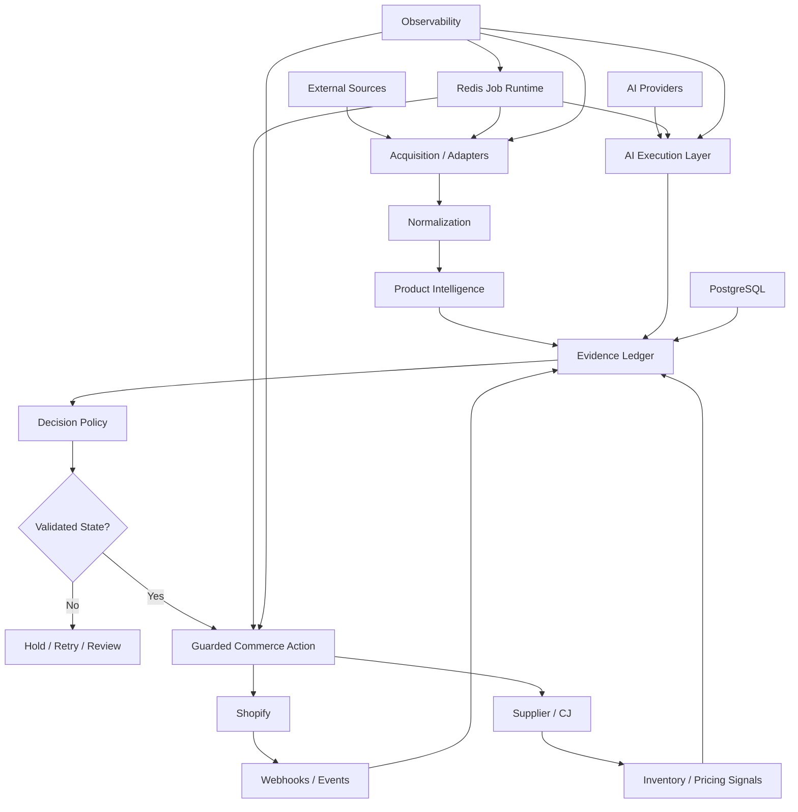

# VEXO AI — Engineering Portfolio


This repository is a **public engineering portfolio** for VEXO AI.

VEXO is a private Python-based commerce automation system covering AI execution, product intelligence, evidence-aware decisioning, supplier integrations, Shopify workflows, resilient background processing, verification, security and observability.

The production implementation remains private. This repository intentionally exposes the **engineering approach, architecture, interfaces and sanitized examples** rather than production source code.

## Engineering Areas

### 1. AI Execution
- Multi-provider AI execution layer
- Capability-based model/provider selection
- Provider health tracking
- Bounded retries and failover
- Cloud and local execution paths
- Explicit failure handling instead of provider assumptions

### 2. Evidence & Decisioning
- Append-only Evidence Ledger
- Explicit evidence states: `observed`, `derived`, `inferred`, `interpreted`, `missing`, `failed`
- Traceable decision inputs
- Evidence gates before sensitive actions
- Separation between evidence collection and decision policy

### 3. Product Intelligence
- Deterministic product identity
- Similarity matching across product sources
- Canonical product representations
- Signal fusion and conflict handling
- Attribute, variant, price and dimension validation
- Consistent product identity across external systems

### 4. Automation & Background Processing
- Redis-backed job processing
- Atomic idempotency
- Worker ownership and leases
- Bounded retries
- Stale-job recovery
- Dead-letter handling
- Heartbeats and graceful shutdown
- Explicit recovery paths for interrupted work

### 5. Commerce Integrations
- Shopify authentication
- Shopify Admin GraphQL
- Commerce-data workflows
- Draft-first product execution
- Activation-sensitive actions guarded by validated state
- Webhook verification with HMAC-SHA256

### 6. Supplier Integration
- Contract-driven supplier adapters
- CJ Dropshipping integration
- Pricing and inventory validation
- Bounded retry policies
- Fail-closed behaviour for invalid or incomplete supplier responses

### 7. Reliability & Verification
- Pytest-based verification
- CI compilation and linting
- Disposable PostgreSQL and Redis environments
- Failure-injection testing
- Docker build verification
- Explicit failure-mode coverage
- Verification of recovery behaviour, not only happy paths

### 8. Security & Observability
- HMAC-SHA256 webhook verification
- Secret validation
- Credential scrubbing
- Correlation IDs
- Request tracing
- Structured logging
- Sentry integration
- Health checks
- Non-root container execution

## Architecture



The important architectural boundary is that **evidence and state are explicit inputs to execution**. Sensitive downstream actions do not rely on an implicit assumption that earlier steps succeeded.

## Engineering Approach

VEXO is designed around a simple principle:

> Detect failure modes explicitly, encode the controls, and verify behaviour.

Examples:

- A provider can timeout or return an unusable response → selection, health state, bounded retries and failover are explicit.
- A background worker can die after accepting a job → ownership, leases and stale recovery are explicit.
- A webhook can be forged or malformed → signature verification and validation are explicit.
- Product information can disagree across sources → canonical identity, conflict handling and validation are explicit.
- Evidence may be incomplete → the decision layer can hold or reject instead of treating missing evidence as approval.
- Commerce execution can be irreversible → draft-first and approval-gated paths reduce accidental activation.

This is the distinction between an automation demo and an automation system that is engineered around real failure conditions.

## Verification

The private VEXO repositories include automated verification around the areas represented here. The public portfolio deliberately shows only sanitized examples and documentation.

Representative verification categories:

| Area | Verification |
| --- | --- |
| Python | Compilation, linting, unit/integration tests |
| Background jobs | Idempotency, ownership, leases, stale recovery |
| Datastores | Disposable PostgreSQL/Redis environments |
| Failure handling | Failure injection and recovery scenarios |
| Integrations | Authentication, request validation, webhook signatures |
| Containers | Docker build/runtime checks |
| Storefront | Theme Check, JSON validation, asset-reference checks |
| Observability | Correlation IDs, structured events, credential scrubbing |

## Public / Private Boundary

The repositories are intentionally separated:

- **Public:** this portfolio, architecture, engineering notes, sanitized examples
- **Private:** production VEXO backend implementation
- **Private:** internal storefront implementation unless explicitly published later

The public repository is intended to demonstrate engineering decisions without publishing reusable production internals, credentials, customer data or operational configuration.

## Repository Map

```text
.
├── README.md
├── LICENSE
├── docs/
│   ├── architecture.md
│   ├── reliability.md
│   ├── integrations.md
│   └── storefront.md
└── examples/
    ├── provider-execution.py
    └── webhook-verification.py
```

## Related Repositories

- [VEXO AI](https://github.com/theprimelotus/vexo-ai) — private production implementation
- [VEXO Shopify](https://github.com/theprimelotus/web-vexo-ai) — private storefront implementation
- [Portfolio](https://github.com/theprimelotus/vexo-ai-portfolio) — this public engineering view

## Engineering Profile

**Focus:** AI systems, automation, backend/platform engineering, integrations, reliability and verification.

**Primary stack:** Python, AsyncIO, Redis, PostgreSQL, Docker, GitHub Actions, Shopify Admin GraphQL, Liquid, Sentry.

**Engineering style:** explicit state, bounded failure handling, traceable evidence, guarded side effects, and verification close to the failure modes.

---

This portfolio is a technical representation of work performed in the private VEXO codebases. It is not a release of the VEXO production source.
